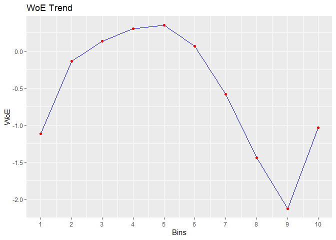

<!-- README.md is generated from README.Rmd. Please edit that file -->

# rbin

> Tools for binning data

[](https://cran.r-project.org/web/checks/check_results_rbin.html)
[](https://travis-ci.org/rsquaredacademy/rbin)
[](https://codecov.io/github/rsquaredacademy/rbin?branch=master)
[](https://cran.r-project.org/package=rbin)
[](https://www.tidyverse.org/lifecycle/#maturing)
[](https://CRAN.R-project.org/package=rbin)

## Installation

``` r
# Install rbin from CRAN
install.packages("rbin")

# Or the development version from GitHub
# install.packages("devtools")
devtools::install_github("rsquaredacademy/rbin")
```

## Addins

rbin includes two addins for manually binning data:

  - `rbinAddin()`
  - `rbinFactorAddin()`

## Usage

### Manual Binning

``` r
bins <- rbin_manual(mbank, y, age, c(29, 31, 34, 36, 39, 42, 46, 51, 56))
bins 
#> Binning Summary
#> ---------------------------
#> Method               Manual 
#> Response             y 
#> Predictor            age 
#> Bins                 10 
#> Count                4521 
#> Goods                517 
#> Bads                 4004 
#> Entropy              0.5 
#> Information Value    0.12 
#> 
#> 
#>    cut_point bin_count good bad          woe           iv   entropy
#> 1       < 29       410   71 339 -0.483686036 2.547353e-02 0.6649069
#> 2       < 31       313   41 272 -0.154776266 1.760055e-03 0.5601482
#> 3       < 34       567   55 512  0.183985174 3.953685e-03 0.4594187
#> 4       < 36       396   45 351  0.007117468 4.425063e-06 0.5107878
#> 5       < 39       519   47 472  0.259825118 7.008270e-03 0.4383322
#> 6       < 42       431   33 398  0.442938178 1.575567e-02 0.3899626
#> 7       < 46       449   47 402  0.099298221 9.423907e-04 0.4836486
#> 8       < 51       521   40 481  0.439981550 1.881380e-02 0.3907140
#> 9       < 56       445   49 396  0.042587647 1.756117e-04 0.5002548
#> 10     >= 56       470   89 381 -0.592843261 4.564428e-02 0.7001343

# plot
plot(bins)
```


### Combine Factor Levels

``` r
# combine levels
upper <- c("secondary", "tertiary")
out <- rbin_factor_combine(mbank, education, upper, "upper")
table(out$education)
#> 
#>   upper unknown primary 
#>    3651     179     691

# bins
bins <- rbin_factor(out, y, education)
bins 
#> Binning Summary
#> ---------------------------
#> Method               Custom 
#> Response             y 
#> Predictor            education 
#> Levels               3 
#> Count                4521 
#> Goods                517 
#> Bads                 4004 
#> Entropy              0.51 
#> Information Value    0.01 
#> 
#> 
#>     level bin_count good  bad         woe           iv   entropy
#> 1   upper      3651  426 3225 -0.02275738 0.0004219212 0.5197428
#> 2 primary       691   66  625  0.20109064 0.0057178780 0.4546110
#> 3 unknown       179   25  154 -0.22892949 0.0022651110 0.5833603

# plot
plot(bins)
```


### Quantile Binning

``` r
bins <- rbin_quantiles(mbank, y, age, 10)
bins 
#> Binning Summary
#> -----------------------------
#> Method               Quantile 
#> Response             y 
#> Predictor            age 
#> Bins                 10 
#> Count                4521 
#> Goods                517 
#> Bads                 4004 
#> Entropy              0.5 
#> Information Value    0.12 
#> 
#> 
#>    cut_point bin_count good bad          woe           iv   entropy
#> 1       < 29       410   71 339 -0.483686036 2.547353e-02 0.6649069
#> 2       < 31       313   41 272 -0.154776266 1.760055e-03 0.5601482
#> 3       < 34       567   55 512  0.183985174 3.953685e-03 0.4594187
#> 4       < 36       396   45 351  0.007117468 4.425063e-06 0.5107878
#> 5       < 39       519   47 472  0.259825118 7.008270e-03 0.4383322
#> 6       < 42       431   33 398  0.442938178 1.575567e-02 0.3899626
#> 7       < 46       449   47 402  0.099298221 9.423907e-04 0.4836486
#> 8       < 51       521   40 481  0.439981550 1.881380e-02 0.3907140
#> 9       < 56       445   49 396  0.042587647 1.756117e-04 0.5002548
#> 10     >= 56       470   89 381 -0.592843261 4.564428e-02 0.7001343

# plot
plot(bins)
```


### Winsorized Binning

``` r
bins <- rbin_winsorize(mbank, y, age, 10, winsor_rate = 0.05)
bins 
#> Binning Summary
#> ------------------------------
#> Method               Winsorize 
#> Response             y 
#> Predictor            age 
#> Bins                 10 
#> Count                4521 
#> Goods                517 
#> Bads                 4004 
#> Entropy              0.51 
#> Information Value    0.1 
#> 
#> 
#>    cut_point bin_count good bad        woe           iv   entropy
#> 1     < 30.2       723  112 611 -0.3504082 0.0224390979 0.6219926
#> 2     < 33.4       567   55 512  0.1839852 0.0039536848 0.4594187
#> 3     < 36.6       573   58 515  0.1367176 0.0022470488 0.4728562
#> 4     < 39.8       497   44 453  0.2846962 0.0079801719 0.4315480
#> 5       < 43       396   37 359  0.2253982 0.0040782670 0.4478305
#> 6     < 46.2       461   43 418  0.2272751 0.0048235624 0.4473095
#> 7     < 49.4       281   22 259  0.4187793 0.0092684760 0.3961315
#> 8     < 52.6       309   32 277  0.1112753 0.0008106706 0.4801796
#> 9     < 55.8       244   25 219  0.1231896 0.0007809490 0.4767424
#> 10   >= 55.8       470   89 381 -0.5928433 0.0456442813 0.7001343

# plot
plot(bins)
```


### Equal Length Binning

``` r
bins <- rbin_equal_length(mbank, y, age, 10)
bins 
#> Binning Summary
#> ---------------------------------
#> Method               Equal Length 
#> Response             y 
#> Predictor            age 
#> Bins                 10 
#> Count                4521 
#> Goods                517 
#> Bads                 4004 
#> Entropy              0.5 
#> Information Value    0.17 
#> 
#> 
#>    cut_point bin_count good  bad         woe           iv   entropy
#> 1     < 24.6        85   24   61 -1.11418623 0.0347480126 0.8586371
#> 2     < 31.2       822  106  716 -0.13676519 0.0035843196 0.5545619
#> 3     < 37.8      1133  115 1018  0.13365680 0.0042514380 0.4737339
#> 4     < 44.4       943   82  861  0.30436899 0.0171748162 0.4262287
#> 5       < 51       623   52  571  0.34913923 0.0146733167 0.4142794
#> 6     < 57.6       612   66  546  0.06595797 0.0005741022 0.4933757
#> 7     < 64.2       229   43  186 -0.58245971 0.0213871054 0.6967893
#> 8     < 70.8        34   12   22 -1.44087046 0.0255269312 0.9366674
#> 9     < 77.4        25   13   12 -2.12704897 0.0471100183 0.9988455
#> 10   >= 77.4        15    4   11 -1.03540535 0.0051663529 0.8366407

# plot
plot(bins)
```



## Alternatives

  - [smbinning](https://CRAN.R-project.org/package=smbinning)
  - [logiBin](https://CRAN.R-project.org/package=logiBin)
  - [woeR](https://CRAN.R-project.org/package=woeR)
  - [woeBinning](https://CRAN.R-project.org/package=woeBinning)
  - [binr](https://CRAN.R-project.org/package=binr)

## Code of Conduct

Please note that this project is released with a [Contributor Code of
Conduct](CONDUCT.md). By participating in this project you agree to
abide by its terms.
