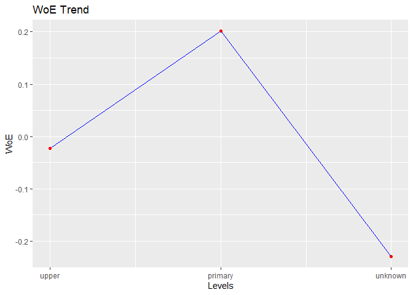

<!-- README.md is generated from README.Rmd. Please edit that file -->

# rbin

> Tools for binning data

[](https://cran.r-project.org/package=rbin)
[](https://cran.r-project.org/web/checks/check_results_rbin.html)
[](https://travis-ci.org/rsquaredacademy/rbin)
[](https://ci.appveyor.com/project/aravindhebbali/rbin)
[](https://codecov.io/github/rsquaredacademy/rbin?branch=master)
[](https://cran.r-project.org/package=rbin)
[](https://www.tidyverse.org/lifecycle/#maturing)

## Installation

``` r
# Install rbin from CRAN
install.packages("rbin")

# Or the development version from GitHub
# install.packages("devtools")
devtools::install_github("rsquaredacademy/rbin")
```

## Addins

rbin includes two addins for manually binning data:

  - `rbinAddin()`
  - `rbinFactorAddin()`

## Usage

### Manual Binning

``` r
bins <- rbin_manual(mbank, y, age, c(29, 31, 34, 36, 39, 42, 46, 51, 56))
bins 
#> Binning Summary
#> ---------------------------
#> Method               Manual 
#> Response             y 
#> Predictor            age 
#> Bins                 10 
#> Count                4521 
#> Goods                517 
#> Bads                 4004 
#> Entropy              0.5 
#> Information Value    0.12 
#> 
#> 
#> # A tibble: 10 x 7
#>    cut_point bin_count  good   bad      woe         iv entropy
#>    <chr>         <int> <int> <int>    <dbl>      <dbl>   <dbl>
#>  1 < 29            410    71   339 -0.484   0.0255       0.665
#>  2 < 31            313    41   272 -0.155   0.00176      0.560
#>  3 < 34            567    55   512  0.184   0.00395      0.459
#>  4 < 36            396    45   351  0.00712 0.00000443   0.511
#>  5 < 39            519    47   472  0.260   0.00701      0.438
#>  6 < 42            431    33   398  0.443   0.0158       0.390
#>  7 < 46            449    47   402  0.0993  0.000942     0.484
#>  8 < 51            521    40   481  0.440   0.0188       0.391
#>  9 < 56            445    49   396  0.0426  0.000176     0.500
#> 10 >= 56           470    89   381 -0.593   0.0456       0.700

# plot
plot(bins)
```


### Combine Factor Levels

``` r
# combine levels
upper <- c("secondary", "tertiary")
out <- rbin_factor_combine(mbank, education, upper, "upper")
table(out$education)
#> 
#> primary unknown   upper 
#>     691     179    3651

# bins
bins <- rbin_factor(out, y, education)
bins 
#> Binning Summary
#> ---------------------------
#> Method               Custom 
#> Response             y 
#> Predictor            education 
#> Levels               3 
#> Count                4521 
#> Goods                517 
#> Bads                 4004 
#> Entropy              0.51 
#> Information Value    0.01 
#> 
#> 
#> # A tibble: 3 x 7
#>   level   bin_count  good   bad     woe       iv entropy
#>   <fct>       <int> <int> <int>   <dbl>    <dbl>   <dbl>
#> 1 primary       691    66   625  0.201  0.00572    0.455
#> 2 unknown       179    25   154 -0.229  0.00227    0.583
#> 3 upper        3651   426  3225 -0.0228 0.000422   0.520

# plot
plot(bins)
```



### Quantile Binning

``` r
bins <- rbin_quantiles(mbank, y, age, 10)
bins 
#> Binning Summary
#> -----------------------------
#> Method               Quantile 
#> Response             y 
#> Predictor            age 
#> Bins                 10 
#> Count                4521 
#> Goods                517 
#> Bads                 4004 
#> Entropy              0.5 
#> Information Value    0.12 
#> 
#> 
#> # A tibble: 10 x 7
#>    cut_point bin_count  good   bad      woe         iv entropy
#>    <chr>         <int> <int> <int>    <dbl>      <dbl>   <dbl>
#>  1 < 29            410    71   339 -0.484   0.0255       0.665
#>  2 < 31            313    41   272 -0.155   0.00176      0.560
#>  3 < 34            567    55   512  0.184   0.00395      0.459
#>  4 < 36            396    45   351  0.00712 0.00000443   0.511
#>  5 < 39            519    47   472  0.260   0.00701      0.438
#>  6 < 42            431    33   398  0.443   0.0158       0.390
#>  7 < 46            449    47   402  0.0993  0.000942     0.484
#>  8 < 51            521    40   481  0.440   0.0188       0.391
#>  9 < 56            445    49   396  0.0426  0.000176     0.500
#> 10 >= 56           470    89   381 -0.593   0.0456       0.700

# plot
plot(bins)
```


### Winsorized Binning

``` r
bins <- rbin_winsorize(mbank, y, age, 10, winsor_rate = 0.05)
bins 
#> Binning Summary
#> ------------------------------
#> Method               Winsorize 
#> Response             y 
#> Predictor            age 
#> Bins                 10 
#> Count                4521 
#> Goods                517 
#> Bads                 4004 
#> Entropy              0.51 
#> Information Value    0.1 
#> 
#> 
#> # A tibble: 10 x 7
#>    cut_point bin_count  good   bad    woe       iv entropy
#>    <chr>         <int> <int> <int>  <dbl>    <dbl>   <dbl>
#>  1 < 30.2          723   112   611 -0.350 0.0224     0.622
#>  2 < 33.4          567    55   512  0.184 0.00395    0.459
#>  3 < 36.6          573    58   515  0.137 0.00225    0.473
#>  4 < 39.8          497    44   453  0.285 0.00798    0.432
#>  5 < 43            396    37   359  0.225 0.00408    0.448
#>  6 < 46.2          461    43   418  0.227 0.00482    0.447
#>  7 < 49.4          281    22   259  0.419 0.00927    0.396
#>  8 < 52.6          309    32   277  0.111 0.000811   0.480
#>  9 < 55.8          244    25   219  0.123 0.000781   0.477
#> 10 >= 55.8         470    89   381 -0.593 0.0456     0.700

# plot
plot(bins)
```


### Equal Length Binning

``` r
bins <- rbin_equal_length(mbank, y, age, 10)
bins 
#> Binning Summary
#> ---------------------------------
#> Method               Equal Length 
#> Response             y 
#> Predictor            age 
#> Bins                 10 
#> Count                4521 
#> Goods                517 
#> Bads                 4004 
#> Entropy              0.5 
#> Information Value    0.17 
#> 
#> 
#> # A tibble: 10 x 7
#>    cut_point bin_count  good   bad     woe       iv entropy
#>    <chr>         <int> <int> <int>   <dbl>    <dbl>   <dbl>
#>  1 < 24.6           85    24    61 -1.11   0.0347     0.859
#>  2 < 31.2          822   106   716 -0.137  0.00358    0.555
#>  3 < 37.8         1133   115  1018  0.134  0.00425    0.474
#>  4 < 44.4          943    82   861  0.304  0.0172     0.426
#>  5 < 51            623    52   571  0.349  0.0147     0.414
#>  6 < 57.6          612    66   546  0.0660 0.000574   0.493
#>  7 < 64.2          229    43   186 -0.582  0.0214     0.697
#>  8 < 70.8           34    12    22 -1.44   0.0255     0.937
#>  9 < 77.4           25    13    12 -2.13   0.0471     0.999
#> 10 >= 77.4          15     4    11 -1.04   0.00517    0.837

# plot
plot(bins)
```


## Alternatives

  - [smbinning](https://CRAN.R-project.org/package=smbinning)
  - [logiBin](https://CRAN.R-project.org/package=logiBin)
  - [woeR](https://CRAN.R-project.org/package=woeR)
  - [woeBinning](https://CRAN.R-project.org/package=woeBinning)
  - [binr](https://CRAN.R-project.org/package=binr)

## Code of Conduct

Please note that this project is released with a [Contributor Code of
Conduct](CONDUCT.md). By participating in this project you agree to
abide by its terms.
